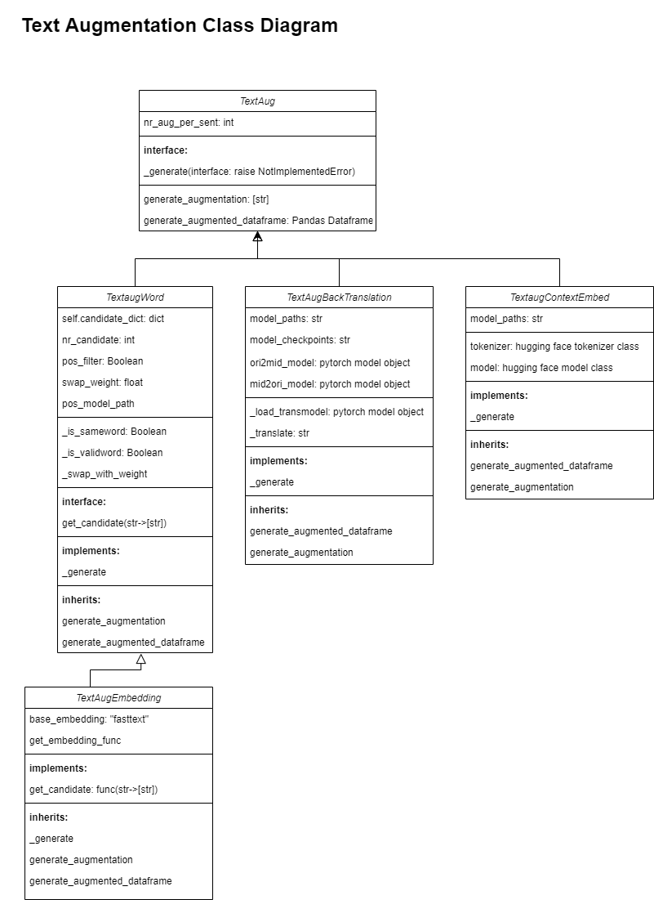

# Text Augmentation
Author: Sitong Ye


## Methodology: 
- Word Embeddings
A paper with an interesting title: "That’s So Annoying!!!: A Lexical and Frame-Semantic Embedding Based Data Augmentation Approach to Automatic Categorization of Annoying Behaviors using #petpeeve Tweets": https://www.aclweb.org/anthology/D15-1306/ introduced the use of word embedding in text augmentation for similar word replacement. Standing on the shoulder of giant, we have access to many open sources, high quality word embedding like word2vec, GLoVe and fasttext that enables us to perform similar methods. This will be introduced in details in the following implementation paragraph. My initial implementation relies on the fasttext german embedding with a dimension of 300: https://fasttext.cc/docs/en/crawl-vectors.html. And May, Philip managed to train a set of telekom domain-specific embedding with fasttext and his telekom corpus. (that's awesome!) They are now downloadable from s3 and can be loaded in the implementation by setting the parameter. 

- Back Translation
Back Translation is another very promising method to both generate text augmentation and paraphrase. The idea is to translate the original text to another language and translate it back. like a round trip: for example de → en and en→ de, the back translated text won't be exactly the same, thus can achieve our goal. In addition to using open translation API, pytorch single language translation models in various languages serve this demand well: https://dl.fbaipublicfiles.com/fairseq/models/. 

- Context Embedding with BERT
Bert is a language representation model (Bidirectional Encoder Representations from Transformers) trained on large corpus e.g. wikipedia and books with Masked word prediction and next sentence predicitons. The motivation of using BERT for augmentation is to mask a certain word in input and let BERT predict the masked word. This will return a list of words based on the context of the input sentence.

## Implementation:



SuperClass TextAug implements basic iterations on input texts or dataframe by applying augmentation functions which are implemented in subclasses.

 TextAug contains three subclasses: TextAugWord,  TextAugBackTranslation and TextaugContextEmbed

TextAugWord provides interface for word-based swapping augmentation. It implements word_swapping algorithms from certain sources of candidates for each word as depicted in Figure 1. TextAugEmbedding for example implements the exact function to extract k nearest words in vector space with a certain trained embedding model(e.g. fasttext).

TextAugBackTranslation implements sentence-based augmentation.

TextaugContextEmbed implements the augmentation with BERT.
## Examples:
### Augmentation with Embedding Example
```python
from TextAugEmbedding import TextAugEmbedding
import os
```

```python
EMBEDDING_MODEL_PATH = "/home/jovyan/voice_analytics/TextAug/models/textaug"
POS_MODEL_PATH = "/home/jovyan/voice_analytics/TextAug/models/textaug/de_core_news_sm-3.0.0/de_core_news_sm/de_core_news_sm-3.0.0/"
```


```python
TG = TextAugEmbedding(nr_candidate=10, nr_aug_per_sent=3,
                      pos_model_path=POS_MODEL_PATH, embedding_path=os.path.join(EMBEDDING_MODEL_PATH, "cc.de.300.bin"),
                      base_embedding="fasttext")
```

```python
TG.generate_augmentation("ich habe eine Frage zu meinem Vertrag.")
```

#### output
    ['ich habe eine überlege zu meinem arbeitsvertrag.',
     'ich habe eine farge zu meinem vertrages.',
     'ich habe eine überlege zu meinem vertrag.']

### Back Translation Example


```python
from TextAugBackTrans import TextaugBackTrans
import os
```


```python
model_path = "/home/jovyan/voice_analytics/TextAug/models"
ori_mid_model_path=os.path.join(model_path, "wmt19.de-en.joined-dict.ensemble")
mid_ori_model_path = os.path.join(model_path, "wmt19.en-de.joined-dict.ensemble")
ori_mid_checkpoints = "model1.pt:model2.pt:model3.pt:model4.pt"
mid_ori_checkpoints = "model1.pt:model2.pt:model3.pt:model4.pt"
```


```python
TG_Backtranslation =TextaugBackTrans(nr_aug_per_sent=1, ori_mid_model_path= ori_mid_model_path, ori_mid_checkpoints=ori_mid_checkpoints,
                                        mid_ori_model_path=mid_ori_model_path, mid_ori_checkpoints=mid_ori_checkpoints)
```


```python
TG_Backtranslation.generate_augmentation("ich habe eine komplizierte Frage zu dem Vertrag und meine Rechung wurde falsch abgebucht, was ist denn los.")
```
### output
    mid_text:  I have a complicated question about the contract and my bill has been debited incorrectly , so what is going on ?
    ['Ich habe eine komplizierte Frage zum Vertrag und meine Rechnung wurde falsch abgebucht . Was ist also los ?']

```python
TG_Backtranslation.generate_augmentation("achso achso ja ja wie Sie mögen ist mir ganz egal")
```
### output
    mid_text:  achso achso yes as you like I don &apos;t care
    ['achso achso ja wie du willst ist mir egal']


----------------------------------------------
